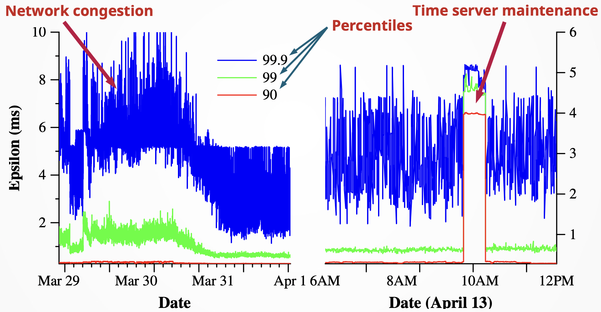

# Datacenter syncronization
- shared, replicated databases
- use paxos locally
- use extremely precise clock for regional sync

> *remove friend from list*
> *post something*
> removed friend should not be able to see my post

**Key feature**: using super precise clock, use **locks** and **wait** for reducing error uncertainties

## True Time clocks
Data centers have true time servers
- regular ones uses **GPS**
- **armageddon masters** uses **atomic clocks**
Time sync uses something like NTP protocol (sorta)
Multiple measured used to remove statistical errors

## Linearization of transactions

- transactions stored as key-value pair
- each transaction has timestamp
  `(key: string, timestamp: int64) -> string`
- paxos used to get consensus in multiple continents

+ gain lock before transaction
+ use time error to calculate wait time
+ release lock when sure no conflicts will emerge
