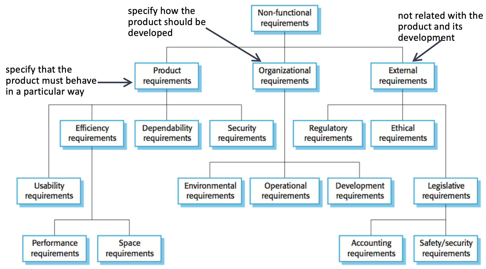

# Software system requirements

> SW requirement is a property that must be exhibited by something in order to solve some problem in the real world

Fundaments properties of the requirement:
- **verifiable** (should be unambiguous and understandable)
- **realizable**

3 requirements abstraction layers
1. *bird view*
2. *sea level*
3. *under the water*

Completeness and consistency requirements
- **completeness**: include descriptions of all required system properties
- **consistency**: there should be no conflicts or contradictions in the descriptions of the system properties

> ⚠ impossible to produce a complete and consistence requirements documents 

Stakeholders
- Users
- Owners
- Government (with laws)
- Developers

## Functional non functional requirements

Functional
- describe the functions that the sw has to execute
- a collector should be able to add coins

Non Functional
- constrains on the solution or ways to archive solution
- non functional requirements should be verifiable using specific metrics
	- No: "fast login"
	- Yes: "login in less than 10 sec"

> Requirements have strong impact on design

## Usability requirements

Usability is the **ease of access** and use of a software both in the GUI and UX
- example:
  all the SPID apps are crap...
  apps that send too much notifications are bad

> This is also called User Experience

Usability can be measured by asking the users and using the system
- Test a prototype with a users group study
- A/B testing (two groups with different systems, you measure metrics)

## Perfomance requirements
- how many users can be connected at the same time
- latency

## Space requirements
- how much memory/storage the system needs
- useful in IoT, embedded systems and in SaaS situations (like if you use AWS 💰)

## Dependability requirements
"the quality of being trustworthy and reliable"
- **availability**
	- ability to deliver services when requested
- **reliability**
	- ability to deliver services as specified
- **safety**
	- ability to operate without catastrophic failures
- **repairability**
	- system can be repaired in case of a failure
- **maintainability**
	- system can be extended and adapted to new requirements
- **fault/error tolerance**
	- user input errors should be avoided and tolerated

