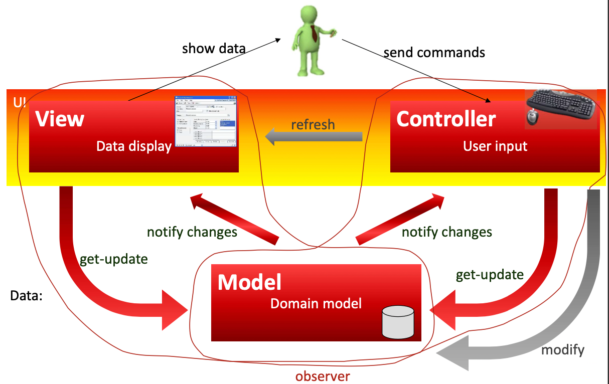

# Architectural Patterns
- name
- problem
- context
- forces
- solution
- resulting context
- examples
- rationale
- related patterns
- known uses

## Pipe &  Filter
- intent: stream/asynchronous data processing
- applicability: large processes that can be broken down into smaller steps
- **pump**, source of data
- **pipe/s** for transferring data
- **filter/s** processing transformations on data
- **sink**, the data target
Pro:
- low coupling
- high reusability
- filters can be replaced/reused since they are black boxes
Cons:
- flooding if filters are slow
- starvation if filter is too fast (waits doing nothing, awaiting data)
- overhead:
	- filter that uses only positive ints has to check if data is ok
	- the next filter has to do the same check since cannot be sure the data is clean

> As a **style**, it defines the *terms*: pump, pipes, filters, data sink. It describes the concepts of those terms
> As a **pattern**, it provides possible solutions, based on the terms. The patterns describes the specific connections between those components (linear filter, split and combine filters...)

## GUI Patterns

- Problem:
	- many ways to work on the same data
- How to:
	- guarantee consistency
	- minimize development
	- make changes easy and cheap
	- allow easy testing
- Solution:
	- UI is distinct from the application
	- application doesn't know anything about UI

> Application gives an interface, UI can use the interface to display an modify application data

## MVC

**Models**: represent knowledge, elements of model are objects, not raw data
**Views**: visual representation of the model. Abstracts from the model showing only relevant data. Acts as a presentation filter. View is attached to the model and gets data from it by asking questions. Updates model by sending commands to it.
**Controllers**: Link between user and system. It's in charge of deciding what view to show the user (creates pixel by pixel the GUI). Processes the input from the user (keystrokes, mouse positions) and passes the result to the view.

> Controllers are inside the OS. Nowadays you don't write controller, you just add a button, a slider...

==Decouple data access and business logic from user interface==
Data access + business logic = (domain) model
One model + multiple UIs

### MVC Solution
**Model** encapsulate core data and functionality, it does application specific operation on data
**View** encapsulate the presentation of data
**Controller** accepts input from user and makes requests from the model for the data to produce a new view

### MVC Consequences
- 👍 view easily replaced or expanded
- 👍 model data changes are reflected in all interfaces because all views are *Observers*
- 👍 better scalability since UI and application logic are separated
- 👍 distribution over a network is simplified
- 👎 business logic bleed into the controller since it has to know function calls to make on the business logic

### MVC Granularity
as design pattern mvc applies to elementary items
- model → individual data
- view →
- controller → 
as architectural patterns mvc applies to:
- model → domain model
- view → output part of UI
- controller → input part of UI

### Problem 2
Designing UIs from scratch can be very expensive.
Solution is to reuse interface elements
So: UIs are built in layers, lower layer knows the application/domain, higher layer built from standard blocks

## MVP - Model View Presenter
view built only from standard elements
view and presenter

==MANCANO ULTIME SLIDE==