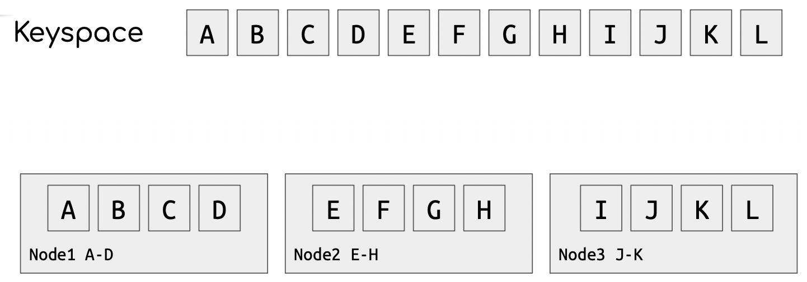
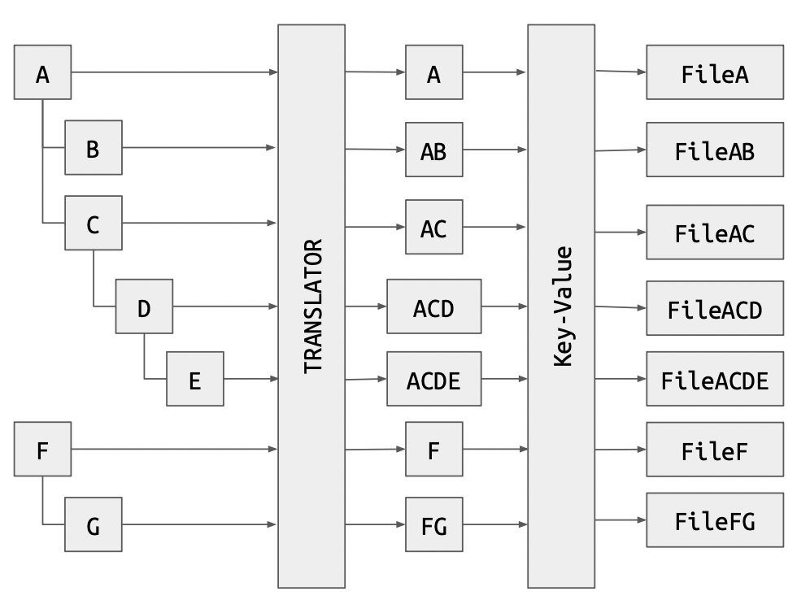

# Virtualized Storage

>*spinny disk goes wroom wroom*

## **Block storage**
device you access block by block (minimum file transfer size)

## **Direct attachment**
directly exposes an underlying device as a virtual block device

## **File-backed block storage**
underlying file is exposed as if it was a hard disk
example: VMWare VM hdds

## **Blocks storage SAN** (Storage Area Network)
- disk attached to another server by streaming commands to its original location
- allows to centralize the management of large fleets of drives
- commands are sent via a network

## **File storage**
- used by generic applications
- features depend on fs implementation
- it's a tree data structure
	- eg the UNIX filesystem

## **Object storage** (pseudo-filesystem)
- exposes key-value or emulated hierarchical structure
- doesn't support typical filesystem operations like locks
	- only `put` and `delete`
- application need changes to operate with ObjStorage
- has O(1) lookup
- easy to distribute via *sharding*

### Sharding
sharding divides data depending on the key value and distributes keys in different nodes

### Simulated hierarchical
fakes an hierarchical data structure by mapping the structures onto a flat key space

## Storage classification

- **RWO**: read-write (one at a time)
- **RWX**: read-write (many at a time)
- **WORM**: write once read many

+ **non distributed**: data is on a single server
+ **distributed**: data spans on multiple servers

- **scale up**: capacity increases by enlarging the servers
- **scale out**: capacity increases by adding servers

### iSCSI – internet small computer systems interface

-
-

### Network File System

-
-

### GusterFS

-
-
GusterFS is a distributed storage solution
builds a filesystem out of *bricks* (directories on servers)

